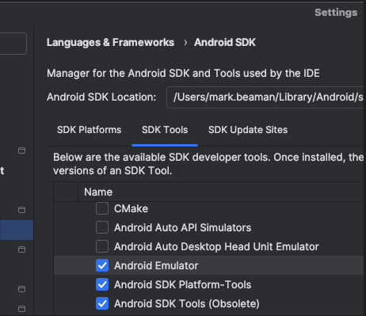

## Installation
```
Install Node: https://nodejs.org/en/download/
```

## Android Studio Setup
Go to url:
```
https://developer.android.com/studio
```

## Webdriver.io Setup
In terminal, navigate to project root folder, then type:
```
npm install
```

## Appium Setup
In terminal, navigate to project root folder, then type:
```
npm install -g appium
appium driver install uiautomator2

Look at url to install and config appium with webdriver.io
https://webdriver.io/docs/appium-service/
```

## Appium Doctor
In terminal, navigate to project root folder, then type:
```
npm install -g @appium/doctor
appium-doctor

Informs missing connections e.g appium with Android Studio:

Common issues:
export ANDROID_HOME=~/Library/Android/sdk
export PATH=$PATH:$ANDROID_HOME/tools:$ANDROID_HOME/tools/bin:$ANDROID_HOME/platform-tools

/usr/libexec/java_home  - this gives u `/Library/Java/JavaVirtualMachines/jdk-18.0.1.1.jdk/Contents/Home`
export JAVA_HOME=/Library/Java/JavaVirtualMachines/jdk-18.0.1.1.jdk/Contents/Home
export PATH=${JAVA_HOME}/bin:$PATH
```
- Go to Android Studio, SDK Manager >> SDK Tools and choose Hide Obsolete Packages
- Install the “Android SDK Tools” which was marked as Obsolete




## Appium Inspector
```
https://inspector.appiumpro.com/ or https://github.com/appium/appium-inspector/releases

setup:
{
  "platformName": "Android",
  "appium:automationName": "UiAutomator2",
  "appium:deviceName": "emulator-5554",
  "appium:appWaitActivity": "com.swaglabsmobileapp.MainActivity",
  "appium:app": "/Users/{NAME}/Documents/workspace/appium/sample/Android.SauceLabs.Mobile.Sample.app.2.7.1.apk"
}

To check listed devices:
In terminal do: `adb devices` then add to "appium:deviceName"
```


## Run your end-to-end tests
```
Android Studio Emulator - Go to Android Studio, new or existing project >> Device Manager, select and run device
npm run appium
npm run test:open
```
execute tests via GUI through emulator


## Lints and fixes files
```
npm run lint
```

## VS Code Setup for Cucumber assistence

### Cucumber (Gherkin) Full Support

- Create Folder called `.vscode`

- Add file called `settings.json`

- Within `settings.json` add:
```

{
  "cucumberautocomplete.steps": ["tests/e2e/step_definitions/*.ts"],
  "cucumberautocomplete.syncfeatures": "tests/e2e/*.feature",
  "cucumberautocomplete.strictGherkinCompletion": false,
  "cucumberautocomplete.smartSnippets": true,
  "cucumberautocomplete.stepsInvariants": true
}
```
